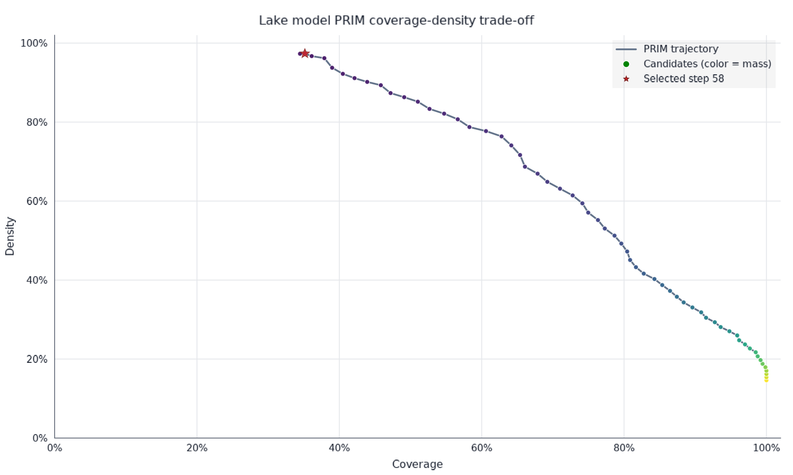
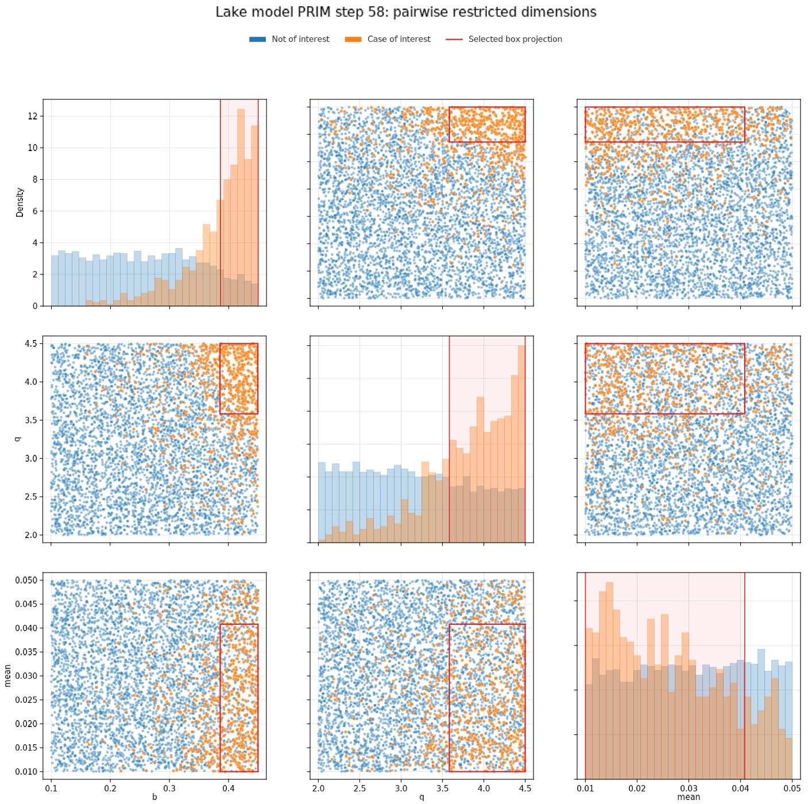

# Tenax

> Hold fast under uncertainty.

**Status:** Roadmap steps 1 and 2 are implemented as an experimental Rust library. The API is not yet stable and no release has been published.

Tenax is a Rust-first toolkit for scenario discovery and robust decision-making under deep uncertainty (DMDU). Scenario discovery identifies combinations of uncertain inputs under which a candidate policy succeeds or fails. Tenax aims to support both analysis of existing experiment data and adaptive evaluation of callable simulation models.

The initial algorithmic focus is the Patient Rule Induction Method (PRIM). Additional scenario-discovery and DMDU methods, such as Classification and Regression Trees (CART), may follow once that foundation has been validated.

## Current functionality

Tenax currently provides a complete path from a callable in-process or subprocess model to scenario discovery:

- Validated model schemas with continuous and integer bounds, categorical domains, binary outputs, and optional input units.
- Deterministic seeded uniform and mixed-domain Latin-hypercube sampling with stable evaluation IDs and explicit model seeds.
- A synchronous, transport-independent, batch-in/chunk-stream-out `Evaluator` trait that separates per-row failures from evaluator/process failures.
- Per-row success or failure data, including returned model errors and caught unwinding panics.
- Sequential and Rayon-parallel in-process closure evaluators, with an explicit fixed-row work-chunk policy and completion-order result streaming.
- Zero-copy borrowed column views over the native `Vec`-backed container, including deterministic `Int32` categorical dictionary codes.
- An optional, versioned Arrow boundary for model-schema discovery, fixed-schema request streams, nullable-output result streams, per-row statuses, and extensible peer diagnostics.
- A persistent subprocess evaluator over bidirectional stdio Arrow IPC, including startup discovery, out-of-order result matching, clean shutdown, and a reference Rust server shell.
- Explicit conversion of a successful evaluated chunk into a static PRIM dataset; failed rows are rejected rather than silently dropped.

Tenax also implements conventional Patient Rule Induction Method (PRIM) analysis for static binary input/output datasets:

- Continuous, integer, and categorical input features.
- EMA Workbench's `lenient1` default objective, the `lenient2` objective, and the original PRIM objective.
- Quantile-based peeling, data-aware categorical peeling, and pasting.
- Complete candidate trajectories with box limits, member row indices, coverage, density, mass, restricted-dimension counts, and one-sided quasi-p values.
- Repeated box discovery with the members of each final box removed from subsequent searches.

`true` output values identify the cases of interest. A minimal analysis looks like this:

```rust
use tenax::{Dataset, Feature, Objective, Prim, PrimConfig};

fn main() -> Result<(), Box<dyn std::error::Error>> {
    let data = Dataset::new(
        vec![
            Feature::continuous("load", vec![0.1, 0.4, 0.8, 0.9])?,
            Feature::categorical(
                "regime",
                ["stable", "stable", "fragile", "fragile"]
                    .into_iter()
                    .map(str::to_owned)
                    .collect(),
            )?,
        ],
        vec![false, false, true, true],
    )?;
    let config = PrimConfig::new(0.1, 0.1, 0.25, Objective::Lenient1)?;
    let first_box = Prim::new(&data, config).find_box().unwrap();

    for candidate in first_box.trajectory() {
        println!("{:?}", candidate.statistics());
    }
    Ok(())
}
```

### In-process model workflow

A callable model uses the same schema and columnar request types as the subprocess and future network adapters:

```rust
use tenax::{
    ChunkingPolicy, Evaluator, InputRow, InputSchema, InputValue, ModelError,
    ModelSchema, OutputSchema, OutputValue, ParallelInProcessEvaluator, RowContext,
    evaluation_to_dataset, sample_uniform,
};

let schema = ModelSchema::new(
    vec![InputSchema::continuous("load", 0.0, 1.0)?],
    vec![OutputSchema::boolean("failure")?],
)?;
let load_position = schema.input_position("load")?;
let failure_position = schema.output_position("failure")?;
let evaluator = ParallelInProcessEvaluator::new(
    schema.clone(),
    move |row: InputRow<'_>, _context: RowContext| {
        let InputValue::Continuous(load) = row
            .value(load_position)
            .map_err(|error| ModelError::new(error.to_string()))?
        else {
            return Err(ModelError::new("load must be continuous"));
        };
        Ok(vec![OutputValue::Boolean(load >= 0.7)])
    },
    ChunkingPolicy::new(64)?,
);

let request = sample_uniform(&schema, 1_000, 42, 0)?;
let retained_request = request.clone();
let result = evaluator
    .evaluate(vec![request])
    .next()
    .expect("one request produces one result chunk")?;
let dataset = evaluation_to_dataset(
    &schema,
    retained_request,
    result,
    failure_position,
)?;
assert_eq!(dataset.row_count(), 1_000);
# Ok::<(), Box<dyn std::error::Error>>(())
```

The parallel evaluator partitions request rows into explicit fixed-size work chunks and runs them on Rayon's global thread pool. It yields one `ChunkResult` per request in completion order, which may differ from request order, while restoring rows within each result to their original order. `InProcessEvaluator` remains available as the single-threaded reference implementation.

### Sampling

`sample_uniform` draws each input independently. `sample_latin_hypercube` places exactly one continuous sample in each equal-probability stratum and uses independently permuted midpoint inverse-CDF strata for integer and categorical domains. The discrete construction remains balanced when rows outnumber available values. Both methods derive feature streams, request IDs, and model seeds deterministically from the run seed and request sequence.

### Arrow boundary

Enable the optional `arrow` feature to convert complete `ModelSchema` discovery contracts plus schema-bound `EvalRequest` and `ChunkResult` values to and from Arrow. Inputs use non-nullable `Float64`, `Int64`, and `Dictionary<Int32, Utf8>` fields. Discovery outputs are non-nullable `Boolean`; result outputs are nullable so failed rows need no sentinel. Versioned metadata preserves roles, domains, and optional units. Fixed-size binary evaluation IDs, `UInt64` seeds, status codes, and failure messages are columns, allowing many request/result batches to share one standard IPC stream schema. Decoding rejects missing metadata, inconsistent context, invalid status/null combinations, non-finite values, schema mismatches, and invalid dictionaries at the boundary.

```console
cargo test --features arrow
cargo bench --bench arrow_conversion --features arrow
```

The benchmark measures validated conversion of 1 million rows by 20 continuous features (160 MB of model inputs), plus 24 MB of fixed evaluation-ID and seed context. A representative release run on an Apple M3 Max measured about 9.5–9.6 ms native-to-Arrow and 15.05–15.14 ms Arrow-to-native. Results are machine-dependent; rerun the benchmark when changing the container or protocol mapping.

### Stdio subprocess transport

Enable `stdio` (which includes `arrow`) to launch a persistent model server. The child writes a schema-only discovery IPC stream followed by a long-lived result stream on stdout, and reads one long-lived request stream on stdin. Request context lives in columns, results may arrive out of request order, and one failed model row remains data while broken IPC or process exit is an evaluator error.

```rust
use std::process::Command;
use tenax::{Evaluator, StdioEvaluator, sample_latin_hypercube};

let command = Command::new("./my-model-server");
let evaluator = StdioEvaluator::spawn(command)?;
let request = sample_latin_hypercube(evaluator.schema(), 10_000, 42, 0)?;
let result = evaluator
    .evaluate(vec![request])
    .next()
    .expect("one request produces one result")?;
assert_eq!(result.rows().len(), 10_000);
let status = evaluator.shutdown()?;
assert!(status.success());
# Ok::<(), Box<dyn std::error::Error>>(())
```

Rust model servers can use `serve_stdio`; Graphcal and Python servers can implement the same language-neutral contract directly. See [`docs/stdio-arrow-ipc.md`](docs/stdio-arrow-ipc.md) for the exact startup sequence, field metadata, ID byte order, status codes, extension fields, and Graphcal binding guidance. The integration test launches a real child and exercises Latin-hypercube sample → stdio IPC evaluate → PRIM:

```console
cargo test --features stdio --test stdio_workflow
```

### Lake model workflow example

[`examples/lake_model/`](examples/lake_model/) applies the complete current workflow to the Direct Policy Search lake problem from EMA Workbench's open-exploration tutorial. It samples 5,000 joint uncertainty-policy inputs, evaluates the stochastic model with deterministic row seeds, classifies `max_P < 0.8`, runs PRIM, and exports the complete trajectory. A pinned Python script uses [XY](https://reflex.dev/docs/xy/) to produce interactive HTML and static PNG trade-off, experiment, and box-limit plots. XY's Matplotlib-compatible pyplot layer composes the EMA-style pairwise scatter-and-box plot, also exported as interactive HTML and static PNG, without requiring Matplotlib.

```console
cargo run --release --example lake_model
./examples/lake_model/plot.py
```

The pinned run produces a 59-step coverage-density trajectory. Its final candidate has 35.2% coverage, 97.3% density, and 5.28% mass, restricting `b`, `q`, and `mean`.



The selected box can also be projected onto every pair of restricted dimensions, with cases of interest in orange and box limits in red:



The example documents the current differences from EMA Workbench, including its deliberate use of uniform rather than the now-available Latin-hypercube sampler, joint rather than factorial experiments, binary output schemas, and fixed-size Rayon work chunking.

Run the complete test suite with `cargo test --all-targets --all-features`.

### Independent reference suite

The integration fixture in [`tests/fixtures/ema_workbench_3_0_0.json`](tests/fixtures/ema_workbench_3_0_0.json) is generated independently by EMA Workbench 3.0.0. The Rust integration test compares every trajectory entry—including limits, selected rows, diagnostics, and quasi-p values—across all three objectives, mixed feature types, and a trajectory with explicit pasting.

Regenerate the reference fixture with:

```console
./scripts/generate_ema_reference.py
```

The executable script uses `uv` inline metadata to pin EMA Workbench and does not import or invoke Tenax.

## Vision

Tenax is planned as a toolbox composed of:

- A reusable Rust library containing the analysis algorithms and transport-independent evaluator interfaces.
- A Rust CLI that analyzes existing datasets or drives callable models through local or remote evaluators.
- A Python library, backed by the Rust core through PyO3, for use in scripts and notebooks.

A model evaluator maps a batch of input configurations to model outputs. It may run in process or behind a remote protocol; analysis algorithms should not depend on the transport used.

## Design goals

- **Correctness and reproducibility:** Validate conventional implementations against synthetic fixtures, behavioral invariants, published examples, and reference implementations such as EMA Workbench.
- **Efficient use of expensive models:** Use adaptive sampling to concentrate evaluations in informative regions instead of relying only on a fixed, precomputed ensemble.
- **Incremental execution:** Reuse previous model evaluations as new observations become available.
- **Batch-parallel execution:** Select and evaluate multiple model configurations concurrently.
- **Anytime results:** After each evaluation batch, return a valid intermediate result together with progress or uncertainty diagnostics, allowing execution to stop at a budget or deadline.
- **Measured performance:** Use Rust for a low-overhead, memory-efficient core, and substantiate performance claims with benchmarks.

## Roadmap

1. **Complete:** Implement conventional PRIM for static input/output datasets and establish a correctness test suite against EMA Workbench.
2. **Complete:** Implement a transport-independent evaluator abstraction, validated model schema, reproducible uniform and Latin-hypercube sampling, sequential and Rayon-parallel in-process workflows, a versioned Arrow request/result contract, and a persistent stdio IPC subprocess transport.
3. Implement adaptive scenario discovery with explicit acquisition and stopping rules. Benchmark it against fixed Latin-hypercube sampling on representative problems.
4. Define the remote HTTP binding over the existing Arrow payload contract, including cancellation and asynchronous execution. Provide a CLI client and reference servers for Rust and Python.
5. Publish a Python package that wraps the Rust core through PyO3 and provides a notebook-friendly API.
6. Evaluate additional analysis methods, such as CART, robustness metrics, and sensitivity analysis, based on demonstrated user needs.

## What is not in scope

- Implementing users' domain-specific simulation models. Tenax treats those models as evaluators.
- Building a dedicated high-density visualization engine. Tenax should expose results in formats that work with visualization libraries such as [Datashader](https://datashader.org/) and [XY](https://reflex.dev/docs/xy/).

## License

Licensed under either of:

- MIT License ([LICENSE-MIT](LICENSE-MIT))
- Apache License, Version 2.0 ([LICENSE-APACHE](LICENSE-APACHE))

at your option.
